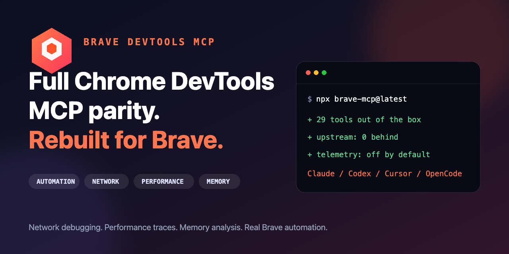

# Brave DevTools for agents

**Full Chrome DevTools MCP parity, rebuilt for Brave.**

[](https://github.com/triuzzi/brave-devtools-mcp/actions/workflows/run-tests.yml)
[](https://www.npmjs.com/package/brave-mcp)
[](https://www.npmjs.com/package/brave-mcp)
[](https://registry.modelcontextprotocol.io/v0.1/servers?search=io.github.triuzzi%2Fbrave-mcp)
[](https://registry.npmjs.org/-/npm/v1/attestations/brave-mcp@1.7.0)
[](https://github.com/triuzzi/brave-devtools-mcp/compare/ChromeDevTools:main...main)
[](./LICENSE)



`brave-mcp` gives Claude Code, Codex, Cursor, OpenCode, and other MCP clients direct access to Brave for browser automation, network and console debugging, performance analysis, screenshots, accessibility inspection, and memory profiling. A standalone [`brave-devtools`](docs/cli.md) CLI is included too.

## Install in one command

### Claude Code

```bash
claude mcp add brave-devtools --scope user -- npx -y brave-mcp@latest
```

### Cursor

```bash
cursor --add-mcp '{"name":"brave-devtools","command":"npx","args":["-y","brave-mcp@latest"]}'
```

### Codex

```bash
codex mcp add brave-devtools -- npx -y brave-mcp@latest
```

### OpenCode

```bash
opencode mcp add brave-devtools -- npx -y brave-mcp@latest
```

Restart your client, then try this prompt:

> Open my app in Brave. Find console errors and failed network requests, inspect the accessibility tree, run Lighthouse, and explain the highest-impact issue.

## Why use this instead of Chrome DevTools MCP?

| Capability                               | `brave-mcp`                             | `chrome-devtools-mcp`                |
| ---------------------------------------- | --------------------------------------- | ------------------------------------ |
| Browser launched and discovered natively | Brave Release, Beta, and Nightly        | Chrome Stable, Beta, Dev, and Canary |
| Attach to an existing browser            | Brave profiles, HTTP, or WebSocket      | Chrome profiles, HTTP, or WebSocket  |
| Upstream DevTools features               | Full parity; currently 0 commits behind | Source implementation                |
| Usage telemetry                          | Disabled by default                     | Enabled by default                   |
| Standalone CLI                           | `brave-devtools`                        | `chrome-devtools`                    |

Use [Chrome DevTools MCP](https://github.com/ChromeDevTools/chrome-devtools-mcp) when your target browser is Chrome. Use `brave-mcp` when your target browser is Brave and you want Brave-native discovery, profiles, channels, naming, and privacy defaults without giving up upstream features.

## [Tool reference](./docs/tool-reference.md) | [Changelog](./CHANGELOG.md) | [Contributing](./CONTRIBUTING.md) | [Troubleshooting](./docs/troubleshooting.md) | [Design principles](./docs/design-principles.md)

## Key features

- **Get performance insights**: Uses [Chrome
  DevTools](https://github.com/ChromeDevTools/devtools-frontend) to record
  traces and extract actionable performance insights.
- **Advanced browser debugging**: Analyze network requests, take screenshots and
  check browser console messages (with source-mapped stack traces).
- **Reliable automation**. Uses
  [puppeteer](https://github.com/puppeteer/puppeteer) to automate actions in
  Brave and automatically wait for action results.

## Disclaimers

`brave-mcp` exposes content of the browser instance to the MCP clients
allowing them to inspect, debug, and modify any data in the browser or DevTools.
Avoid sharing sensitive or personal information that you don't want to share with
MCP clients.

`brave-mcp` officially supports the current Brave release. Beta and Nightly channels can be selected explicitly.

Performance tools may send trace URLs to the Google CrUX API to fetch real-user
experience data. This helps provide a holistic performance picture by
presenting field data alongside lab data. This data is collected by the [Chrome
User Experience Report (CrUX)](https://developer.chrome.com/docs/crux). To disable
this, run with the `--no-performance-crux` flag.

## **Usage statistics**

Usage statistics collection is **disabled by default** in this fork. It can be enabled explicitly with `--usage-statistics`, which uses the upstream Google Clearcut implementation:

```json
"args": ["-y", "brave-mcp@latest", "--usage-statistics"]
```

When enabled, Google handles this data in accordance with the [Google Privacy Policy](https://policies.google.com/privacy). Collection remains disabled if `BRAVE_DEVTOOLS_MCP_NO_USAGE_STATISTICS` or `CI` is set.

## Update checks

By default, the server periodically checks the npm registry for updates and logs a notification when a newer version is available.
You can disable these update checks by setting `BRAVE_DEVTOOLS_MCP_NO_UPDATE_CHECKS`.

## Requirements

- [Node.js](https://nodejs.org/) [LTS](https://github.com/nodejs/Release#release-schedule) version.
- [Brave](https://brave.com/download/) current release or newer.
- [npm](https://www.npmjs.com/)

## Getting started

Add the following config to your MCP client:

```json
{
  "mcpServers": {
    "brave-devtools": {
      "command": "npx",
      "args": ["-y", "brave-mcp@latest"]
    }
  }
}
```

> [!NOTE]
> Using `brave-mcp@latest` ensures that your MCP client will always use the latest version of the Brave DevTools MCP server.

If you are interested in doing only basic browser tasks, use the `--slim` mode:

```json
{
  "mcpServers": {
    "brave-devtools": {
      "command": "npx",
      "args": ["-y", "brave-mcp@latest", "--slim", "--headless"]
    }
  }
}
```

See [Slim tool reference](./docs/slim-tool-reference.md).

### MCP Client configuration

<details>
  <summary>Amp</summary>
  Follow https://ampcode.com/manual#mcp and use the config provided above. You can also install the Brave DevTools MCP server using the CLI:

```bash
amp mcp add brave-devtools -- npx brave-mcp@latest
```

</details>

<details>
  <summary>Antigravity</summary>

To use the Brave DevTools MCP server follow the instructions from <a href="https://antigravity.google/docs/mcp">Antigravity's docs</a> to install a custom MCP server. Add the following config to the MCP servers config:

```bash
{
  "mcpServers": {
    "brave-devtools": {
      "command": "npx",
      "args": [
        "-y",
        "brave-mcp@latest",
        "--browser-url=http://127.0.0.1:9222"
      ]
    }
  }
}
```

This will make the Brave DevTools MCP server automatically connect to the browser that Antigravity is using. If you are not using port 9222, make sure to adjust accordingly.

Brave DevTools MCP will not start the browser instance automatically using this approach because the Brave DevTools MCP server connects to Antigravity's built-in browser. If the browser is not already running, you have to start it first by clicking the Chrome icon at the top right corner.

</details>

<details>
  <summary>Bob</summary>

Follow the <a href="https://bob.ibm.com/docs/ide/configuration/mcp/mcp-in-bob">IBM Bob MCP guide</a> and add the Brave DevTools MCP server to your Bob MCP configuration. Use the global config (`~/.bob/mcp.json`) to apply it across all workspaces, or a project config (`.bob/mcp.json`) to scope it to one project:

```json
{
  "mcpServers": {
    "brave-devtools": {
      "command": "npx",
      "args": ["-y", "brave-mcp@latest"]
    }
  }
}
```

You can edit these files from **Bob panel → Settings → MCP → Edit Global MCP** (or **Edit Project MCP**). Bob hot-reloads on save. Once the server appears in the MCP tab, switch to the **🌎 Browser Dev** mode to get guided browser debugging directly in Bob.

</details>

<details>
  <summary>Claude Code</summary>

**Install via CLI (MCP only)**

Use the Claude Code CLI to add the Brave DevTools MCP server (<a href="https://code.claude.com/docs/en/mcp">guide</a>):

```bash
claude mcp add brave-devtools --scope user npx brave-mcp@latest
```

**Install as a Plugin (MCP + Skills)**

> [!NOTE]
> If you already had Brave DevTools MCP installed previously for Claude Code, make sure to remove it first from your installation and configuration files.

To install Brave DevTools MCP with skills, add the marketplace registry in Claude Code:

```sh
/plugin marketplace add triuzzi/brave-devtools-mcp
```

Then, install the plugin:

```sh
/plugin install brave-devtools-mcp@brave-devtools-plugins
```

Restart Claude Code to have the MCP server and skills load (check with `/skills`).

> [!TIP]
> If the plugin installation fails with a `Failed to clone repository` error (e.g., HTTPS connectivity issues behind a corporate firewall), see the [troubleshooting guide](./docs/troubleshooting.md#claude-code-plugin-installation-fails-with-failed-to-clone-repository) for workarounds, or use the CLI installation method above instead.

</details>

<details>
  <summary>Cline</summary>
  Follow https://docs.cline.bot/mcp/configuring-mcp-servers and use the config provided above.
</details>

<details>
  <summary>Codex</summary>
  Follow the <a href="https://developers.openai.com/codex/mcp/#configure-with-the-cli">configure MCP guide</a>
  using the standard config from above. You can also install the Brave DevTools MCP server using the Codex CLI:

```bash
codex mcp add brave-devtools -- npx brave-mcp@latest
```

**On Windows 11**

Configure the Brave install location and increase the startup timeout by updating `.codex/config.toml` and adding the following `env` and `startup_timeout_ms` parameters:

```
[mcp_servers.brave-devtools]
command = "cmd"
args = [
    "/c",
    "npx",
    "-y",
    "brave-mcp@latest",
]
env = { SystemRoot="C:\\Windows", PROGRAMFILES="C:\\Program Files" }
startup_timeout_ms = 20_000
```

</details>

<details>
  <summary>Command Code</summary>

Use the Command Code CLI to add the Brave DevTools MCP server (<a href="https://commandcode.ai/docs/mcp">MCP guide</a>):

```bash
cmd mcp add brave-devtools --scope user npx brave-mcp@latest
```

</details>

<details>
  <summary>Copilot CLI</summary>

Start Copilot CLI:

```
copilot
```

Start the dialog to add a new MCP server by running:

```
/mcp add
```

Configure the following fields and press `CTRL+S` to save the configuration:

- **Server name:** `brave-devtools`
- **Server Type:** `[1] Local`
- **Command:** `npx -y brave-mcp@latest`

</details>

<details>
  <summary>Copilot / VS Code</summary>

**Install as a Plugin (Recommended)**

The easiest way to get up and running is to install `brave-mcp` as an agent plugin.
This bundles the **MCP server** and all **skills** together, so your agent gets both the tools
and the expert guidance it needs to use them effectively.

1.  Open the **Command Palette** (`Cmd+Shift+P` on macOS or `Ctrl+Shift+P` on Windows/Linux).
2.  Search for and run the **Chat: Install Plugin From Source** command.
3.  Paste in our repository name: `triuzzi/brave-devtools-mcp`.

That's it! Your agent is now supercharged with Brave DevTools capabilities.

---

**Install as an MCP Server (MCP only)**

**Click the button to install:**

[](https://vscode.dev/redirect/mcp/install?name=io.github.triuzzi%2Fbrave-mcp&config=%7B%22command%22%3A%22npx%22%2C%22args%22%3A%5B%22-y%22%2C%22brave-mcp%22%5D%2C%22env%22%3A%7B%7D%7D)

[](https://insiders.vscode.dev/redirect?url=vscode-insiders%3Amcp%2Finstall%3F%257B%2522name%2522%253A%2522io.github.triuzzi%252Fbrave-mcp%2522%252C%2522config%2522%253A%257B%2522command%2522%253A%2522npx%2522%252C%2522args%2522%253A%255B%2522-y%2522%252C%2522brave-mcp%2522%255D%252C%2522env%2522%253A%257B%257D%257D%257D)

**Or install manually:**

Follow the VS Code [MCP configuration guide](https://code.visualstudio.com/docs/copilot/chat/mcp-servers#_add-an-mcp-server) using the standard config from above, or use the CLI:

For macOS and Linux:

```bash
code --add-mcp '{"name":"io.github.triuzzi/brave-devtools-mcp","command":"npx","args":["-y","brave-mcp"],"env":{}}'
```

For Windows (PowerShell):

```powershell
code --add-mcp '{"""name""":"""io.github.triuzzi/brave-devtools-mcp""","""command""":"""npx""","""args""":["""-y""","""brave-mcp"""]}'
```

</details>

<details>
  <summary>Cursor</summary>

**Click the button to install:**

[](https://cursor.com/en/install-mcp?name=brave-devtools&config=eyJjb21tYW5kIjoibnB4IC15IGJyYXZlLW1jcEBsYXRlc3QifQ%3D%3D)

**Or install manually:**

Go to `Cursor Settings` -> `MCP` -> `New MCP Server`. Use the config provided above.

</details>

<details>
  <summary>Devin CLI</summary>

**Install via CLI (MCP only)**

Use the Devin CLI to add the Brave DevTools MCP server (<a href="https://docs.devin.ai/cli/extensibility/mcp/configuration">guide</a>):

```bash
devin mcp add brave-devtools -- npx brave-mcp@latest
```

</details>

<details>
  <summary>Factory CLI</summary>
Use the Factory CLI to add the Brave DevTools MCP server (<a href="https://docs.factory.ai/cli/configuration/mcp">guide</a>):

```bash
droid mcp add brave-devtools "npx -y brave-mcp@latest"
```

</details>

<details>
  <summary>Gemini CLI</summary>
Install the Brave DevTools MCP server using the Gemini CLI.

**Project wide:**

```bash
# Either MCP only:
gemini mcp add brave-devtools npx brave-mcp@latest
# Or as a Gemini extension (MCP+Skills):
gemini extensions install --auto-update https://github.com/triuzzi/brave-devtools-mcp
```

**Globally:**

```bash
gemini mcp add -s user brave-devtools npx brave-mcp@latest
```

Alternatively, follow the <a href="https://github.com/google-gemini/gemini-cli/blob/main/docs/tools/mcp-server.md#how-to-set-up-your-mcp-server">MCP guide</a> and use the standard config from above.

</details>

<details>
  <summary>Gemini Code Assist</summary>
  Follow the <a href="https://cloud.google.com/gemini/docs/codeassist/use-agentic-chat-pair-programmer#configure-mcp-servers">configure MCP guide</a>
  using the standard config from above.
</details>

<details>
  <summary>Grok Build CLI</summary>

```bash
grok mcp add brave-devtools npx brave-mcp@latest
```

See the <a href="https://docs.x.ai/build/features/skills-plugins-marketplaces">docs</a> for more options
</details>

<details>
  <summary>JetBrains AI Assistant & Junie</summary>

Go to `Settings | Tools | AI Assistant | Model Context Protocol (MCP)` -> `Add`. Use the config provided above.
The same way brave-mcp can be configured for JetBrains Junie in `Settings | Tools | Junie | MCP Settings` -> `Add`. Use the config provided above.

</details>

<details>
  <summary>Kiro</summary>

In **Kiro Settings**, go to `Configure MCP` > `Open Workspace or User MCP Config` > Use the configuration snippet provided above.

Or, from the IDE **Activity Bar** > `Kiro` > `MCP Servers` > `Click Open MCP Config`. Use the configuration snippet provided above.

</details>

<details>
  <summary>Katalon Studio</summary>

The Brave DevTools MCP server can be used with Katalon StudioAssist via an MCP proxy.

**Step 1:** Install the MCP proxy by following the <a href="https://docs.katalon.com/katalon-studio/studioassist/mcp-servers/setting-up-mcp-proxy-for-stdio-mcp-servers">MCP proxy setup guide</a>.

**Step 2:** Start the Brave DevTools MCP server with the proxy:

```bash
mcp-proxy --transport streamablehttp --port 8080 -- npx -y brave-mcp@latest
```

**Note:** You may need to pick another port if 8080 is already in use.

**Step 3:** In Katalon Studio, add the server to StudioAssist with the following settings:

- **Connection URL:** `http://127.0.0.1:8080/mcp`
- **Transport type:** `HTTP`

Once connected, the Brave DevTools MCP tools will be available in StudioAssist.

</details>

<details>
  <summary>Mistral Vibe</summary>

Add in ~/.vibe/config.toml:

```toml
[[mcp_servers]]
name = "brave-devtools"
transport = "stdio"
command = "npx"
args = ["brave-mcp@latest"]
```

</details>

<details>
  <summary>OpenCode</summary>

Add the following configuration to your `opencode.json` file. If you don't have one, create it at `~/.config/opencode/opencode.json` (<a href="https://opencode.ai/docs/mcp-servers">guide</a>):

```json
{
  "$schema": "https://opencode.ai/config.json",
  "mcp": {
    "brave-devtools": {
      "type": "local",
      "command": ["npx", "-y", "brave-mcp@latest"]
    }
  }
}
```

</details>

<details>
  <summary>Qoder</summary>

In **Qoder Settings**, go to `MCP Server` > `+ Add` > Use the configuration snippet provided above.

Alternatively, follow the <a href="https://docs.qoder.com/user-guide/chat/model-context-protocol">MCP guide</a> and use the standard config from above.

</details>

<details>
  <summary>Qoder CLI</summary>

Install the Brave DevTools MCP server using the Qoder CLI (<a href="https://docs.qoder.com/cli/using-cli#mcp-servers">guide</a>):

**Project wide:**

```bash
qodercli mcp add brave-devtools -- npx brave-mcp@latest
```

**Globally:**

```bash
qodercli mcp add -s user brave-devtools -- npx brave-mcp@latest
```

</details>

<details>
  <summary>Visual Studio</summary>

**Click the button to install:**

[](https://vs-open.link/mcp-install?%7B%22name%22%3A%22brave-devtools%22%2C%22command%22%3A%22npx%22%2C%22args%22%3A%5B%22brave-mcp%40latest%22%5D%7D)

</details>

<details>
  <summary>Warp</summary>

Go to `Settings | AI | Manage MCP Servers` -> `+ Add` to [add an MCP Server](https://docs.warp.dev/knowledge-and-collaboration/mcp#adding-an-mcp-server). Use the config provided above.

</details>

<details>
  <summary>Windsurf</summary>
  Follow the <a href="https://docs.windsurf.com/windsurf/cascade/mcp#mcp-config-json">configure MCP guide</a>
  using the standard config from above.
</details>

### Your first prompt

Enter the following prompt in your MCP Client to check if everything is working:

```
Check the performance of https://developers.chrome.com
```

Your MCP client should open the browser and record a performance trace.

> [!NOTE]
> The MCP server will start the browser automatically once the MCP client uses a tool that requires a running browser instance. Connecting to the Brave DevTools MCP server on its own will not automatically start the browser.

## Tools

If you run into any issues, checkout our [troubleshooting guide](./docs/troubleshooting.md).

<!-- BEGIN AUTO GENERATED TOOLS -->

- **Input automation** (10 tools)
  - [`click`](docs/tool-reference.md#click)
  - [`drag`](docs/tool-reference.md#drag)
  - [`fill`](docs/tool-reference.md#fill)
  - [`fill_form`](docs/tool-reference.md#fill_form)
  - [`handle_dialog`](docs/tool-reference.md#handle_dialog)
  - [`hover`](docs/tool-reference.md#hover)
  - [`press_key`](docs/tool-reference.md#press_key)
  - [`type_text`](docs/tool-reference.md#type_text)
  - [`upload_file`](docs/tool-reference.md#upload_file)
  - [`click_at`](docs/tool-reference.md#click_at)
- **Navigation automation** (6 tools)
  - [`close_page`](docs/tool-reference.md#close_page)
  - [`list_pages`](docs/tool-reference.md#list_pages)
  - [`navigate_page`](docs/tool-reference.md#navigate_page)
  - [`new_page`](docs/tool-reference.md#new_page)
  - [`select_page`](docs/tool-reference.md#select_page)
  - [`wait_for`](docs/tool-reference.md#wait_for)
- **Emulation** (2 tools)
  - [`emulate`](docs/tool-reference.md#emulate)
  - [`resize_page`](docs/tool-reference.md#resize_page)
- **Performance** (3 tools)
  - [`performance_analyze_insight`](docs/tool-reference.md#performance_analyze_insight)
  - [`performance_start_trace`](docs/tool-reference.md#performance_start_trace)
  - [`performance_stop_trace`](docs/tool-reference.md#performance_stop_trace)
- **Network** (2 tools)
  - [`get_network_request`](docs/tool-reference.md#get_network_request)
  - [`list_network_requests`](docs/tool-reference.md#list_network_requests)
- **Debugging** (8 tools)
  - [`evaluate_script`](docs/tool-reference.md#evaluate_script)
  - [`get_console_message`](docs/tool-reference.md#get_console_message)
  - [`lighthouse_audit`](docs/tool-reference.md#lighthouse_audit)
  - [`list_console_messages`](docs/tool-reference.md#list_console_messages)
  - [`take_screenshot`](docs/tool-reference.md#take_screenshot)
  - [`take_snapshot`](docs/tool-reference.md#take_snapshot)
  - [`screencast_start`](docs/tool-reference.md#screencast_start)
  - [`screencast_stop`](docs/tool-reference.md#screencast_stop)
- **Memory** (12 tools)
  - [`take_heapsnapshot`](docs/tool-reference.md#take_heapsnapshot)
  - [`close_heapsnapshot`](docs/tool-reference.md#close_heapsnapshot)
  - [`compare_heapsnapshots`](docs/tool-reference.md#compare_heapsnapshots)
  - [`get_heapsnapshot_class_nodes`](docs/tool-reference.md#get_heapsnapshot_class_nodes)
  - [`get_heapsnapshot_details`](docs/tool-reference.md#get_heapsnapshot_details)
  - [`get_heapsnapshot_dominators`](docs/tool-reference.md#get_heapsnapshot_dominators)
  - [`get_heapsnapshot_duplicate_strings`](docs/tool-reference.md#get_heapsnapshot_duplicate_strings)
  - [`get_heapsnapshot_edges`](docs/tool-reference.md#get_heapsnapshot_edges)
  - [`get_heapsnapshot_object_details`](docs/tool-reference.md#get_heapsnapshot_object_details)
  - [`get_heapsnapshot_retainers`](docs/tool-reference.md#get_heapsnapshot_retainers)
  - [`get_heapsnapshot_retaining_paths`](docs/tool-reference.md#get_heapsnapshot_retaining_paths)
  - [`get_heapsnapshot_summary`](docs/tool-reference.md#get_heapsnapshot_summary)
- **Extensions** (5 tools)
  - [`install_extension`](docs/tool-reference.md#install_extension)
  - [`list_extensions`](docs/tool-reference.md#list_extensions)
  - [`reload_extension`](docs/tool-reference.md#reload_extension)
  - [`trigger_extension_action`](docs/tool-reference.md#trigger_extension_action)
  - [`uninstall_extension`](docs/tool-reference.md#uninstall_extension)
- **Third-party** (2 tools)
  - [`execute_3p_developer_tool`](docs/tool-reference.md#execute_3p_developer_tool)
  - [`list_3p_developer_tools`](docs/tool-reference.md#list_3p_developer_tools)
- **WebMCP** (2 tools)
  - [`execute_webmcp_tool`](docs/tool-reference.md#execute_webmcp_tool)
  - [`list_webmcp_tools`](docs/tool-reference.md#list_webmcp_tools)
- **Progressive Web Apps** (4 tools)
  - [`get_os_app_state`](docs/tool-reference.md#get_os_app_state)
  - [`install_pwa`](docs/tool-reference.md#install_pwa)
  - [`launch_pwa`](docs/tool-reference.md#launch_pwa)
  - [`uninstall_pwa`](docs/tool-reference.md#uninstall_pwa)

<!-- END AUTO GENERATED TOOLS -->

## Configuration

The Brave DevTools MCP server supports the following configuration option:

<!-- BEGIN AUTO GENERATED OPTIONS -->

- **`--autoConnect`/ `--auto-connect`**
  If specified, automatically connects to a Brave instance running locally from the user data directory identified by the channel parameter (default channel is release). Requires remote debugging to be enabled via brave://inspect/#remote-debugging.
  - **Type:** boolean
  - **Default:** `false`

- **`--browserUrl`/ `--browser-url`, `-u`**
  Connect to a running, debuggable Brave instance (e.g. `http://127.0.0.1:9222`). For more details see: https://github.com/triuzzi/brave-devtools-mcp#connecting-to-a-running-brave-instance.
  - **Type:** string
  - **Default:** `false`

- **`--wsEndpoint`/ `--ws-endpoint`, `-w`**
  WebSocket endpoint to connect to a running Brave instance (e.g., ws://127.0.0.1:9222/devtools/browser/<id>). Alternative to --browserUrl.
  - **Type:** string
  - **Default:** `false`

- **`--wsHeaders`/ `--ws-headers`**
  Custom headers for WebSocket connection in JSON format (e.g., '{"Authorization":"Bearer token"}'). Only works with --wsEndpoint.
  - **Type:** string
  - **Default:** `false`

- **`--headless`**
  Whether to run in headless (no UI) mode.
  - **Type:** boolean
  - **Default:** `false`

- **`--executablePath`/ `--executable-path`, `-e`**
  Path to a custom Brave executable. Can also be set via BRAVE_PATH.
  - **Type:** string
  - **Default:** `false`

- **`--isolated`**
  If specified, creates a temporary user-data-dir that is automatically cleaned up after the browser is closed. Defaults to false.
  - **Type:** boolean
  - **Default:** `false`

- **`--userDataDir`/ `--user-data-dir`**
  Path to the user data directory for Brave. Default is $HOME/.cache/brave-devtools-mcp/brave-profile$CHANNEL_SUFFIX_IF_NON_RELEASE
  - **Type:** string
  - **Default:** `false`

- **`--channel`**
  Specify a different Brave channel. The default is the release channel.
  - **Type:** string
  - **Choices:** `release`, `beta`, `nightly`
  - **Default:** `false`

- **`--logFile`/ `--log-file`**
  Path to a file to write debug logs to. Set the env variable `DEBUG` to `*` to enable verbose logs. Useful for submitting bug reports.
  - **Type:** string
  - **Default:** `false`

- **`--viewport`**
  Initial viewport size for Brave instances started by the server. For example, `1280x720`. In headless mode, max size is 3840x2160px.
  - **Type:** string
  - **Default:** `false`

- **`--proxyServer`/ `--proxy-server`**
  Proxy server configuration for Brave passed as --proxy-server when launching the browser. See https://www.chromium.org/developers/design-documents/network-settings/ for details.
  - **Type:** string
  - **Default:** `false`

- **`--acceptInsecureCerts`/ `--accept-insecure-certs`**
  If enabled, ignores errors relative to self-signed and expired certificates. Use with caution.
  - **Type:** boolean
  - **Default:** `false`

- **`--experimentalPageIdRouting`/ `--experimental-page-id-routing`**
  Whether to expose pageId on page-scoped tools and route requests by page ID (useful for concurrent agent sessions).
  - **Type:** boolean
  - **Default:** `false`

- **`--experimentalDevtools`/ `--experimental-devtools`**
  Whether to enable automation over DevTools targets
  - **Type:** boolean
  - **Default:** `false`

- **`--experimentalVision`/ `--experimental-vision`**
  Whether to enable coordinate-based tools such as click_at(x,y). Usually requires a computer-use model able to produce accurate coordinates by looking at screenshots.
  - **Type:** boolean
  - **Default:** `false`

- **`--memoryDebugging`/ `--memory-debugging`, `-experimentalMemory`**
  Whether to enable memory debugging tools.
  - **Type:** boolean
  - **Default:** `false`

- **`--experimentalStructuredContent`/ `--experimental-structured-content`**
  Whether to output structured formatted content.
  - **Type:** boolean
  - **Default:** `false`

- **`--experimentalIncludeAllPages`/ `--experimental-include-all-pages`**
  Whether to include all kinds of pages such as webviews or background pages as pages.
  - **Type:** boolean
  - **Default:** `false`

- **`--experimentalScreencast`/ `--experimental-screencast`**
  Exposes experimental screencast tools (requires ffmpeg). Install ffmpeg https://www.ffmpeg.org/download.html and ensure it is available in the MCP server PATH.
  - **Type:** boolean
  - **Default:** `false`

- **`--experimentalFfmpegPath`/ `--experimental-ffmpeg-path`**
  Path to ffmpeg executable for screencast recording.
  - **Type:** string
  - **Default:** `false`

- **`--categoryExperimentalWebmcp`/ `--category-experimental-webmcp`**
  Set to true to enable debugging WebMCP tools. Requires a recent Brave version with the following flags: `--enable-features=WebMCP,DevToolsWebMCPSupport`
  - **Type:** boolean
  - **Default:** `false`

- **`--braveArg`/ `--brave-arg`**
  Additional arguments for Brave. Only applies when Brave is launched by brave-devtools-mcp.
  - **Type:** array
  - **Default:** `false`

- **`--blockedUrlPattern`/ `--blocked-url-pattern`**
  Restricts browser's network access by blocking specified URL patterns (uses https://urlpattern.spec.whatwg.org/). Silently detaches from targets with blocked URLs upon connection, and blocks runtime requests (including navigations and subresources). Accepts an array of patterns.
  - **Type:** array
  - **Default:** `false`

- **`--allowedUrlPattern`/ `--allowed-url-pattern`**
  Restricts browser's network access by allowing only specified URL patterns (uses https://urlpattern.spec.whatwg.org/). Requires a recent Brave version. Silently detaches from targets with unallowed URLs upon connection, and blocks runtime requests (including navigations and subresources). Accepts an array of patterns.
  - **Type:** array
  - **Default:** `false`

- **`--ignoreDefaultBraveArg`/ `--ignore-default-brave-arg`**
  Explicitly disable default arguments for Brave. Only applies when Brave is launched by brave-devtools-mcp.
  - **Type:** array
  - **Default:** `false`

- **`--categoryEmulation`/ `--category-emulation`**
  Set to false to exclude tools related to emulation.
  - **Type:** boolean
  - **Default:** `true`

- **`--categoryPerformance`/ `--category-performance`**
  Set to false to exclude tools related to performance.
  - **Type:** boolean
  - **Default:** `true`

- **`--categoryNetwork`/ `--category-network`**
  Set to false to exclude tools related to network.
  - **Type:** boolean
  - **Default:** `true`

- **`--categoryExtensions`/ `--category-extensions`**
  Set to true to include tools related to extensions. This feature is only supported with a pipe connection; autoConnect, browserUrl, and wsEndpoint are not supported.
  - **Type:** boolean
  - **Default:** `false`

- **`--categoryExperimentalThirdParty`/ `--category-experimental-third-party`**
  Set to true to enable third-party developer tools exposed by the inspected page itself
  - **Type:** boolean
  - **Default:** `false`

- **`--categoryPwa`/ `--category-pwa`**
  Set to true to include tools for automating Progressive Web Apps (install, launch, uninstall, and OS state). This feature is only supported with a pipe connection; autoConnect, browserUrl, and wsEndpoint are not supported.
  - **Type:** boolean
  - **Default:** `false`

- **`--performanceCrux`/ `--performance-crux`**
  Set to false to disable sending URLs from performance traces to CrUX API to get field performance data.
  - **Type:** boolean
  - **Default:** `true`

- **`--usageStatistics`/ `--usage-statistics`**
  Usage statistics collection is disabled by default in this fork.
  - **Type:** boolean
  - **Default:** `false`

- **`--screenshotFormat`/ `--screenshot-format`**
  Override the default output format used by take_screenshot when the caller does not specify one. JPEG and WebP are ~3-5x smaller than PNG, which helps reduce context size in AI conversations. Unset preserves the existing default ("png").
  - **Type:** string
  - **Choices:** `jpeg`, `png`, `webp`
  - **Default:** `false`

- **`--screenshotQuality`/ `--screenshot-quality`**
  Override the default compression quality (0-100) used by take_screenshot for JPEG and WebP when the caller does not specify one. Lower values mean smaller files. Ignored for PNG. Unset preserves the Puppeteer default.
  - **Type:** number
  - **Default:** `false`

- **`--screenshotMaxWidth`/ `--screenshot-max-width`**
  Maximum width in pixels for screenshots. If the captured image is wider, it is downscaled (preserving aspect ratio) before being returned. Reduces context size in AI conversations. Unset means no resize.
  - **Type:** number
  - **Default:** `false`

- **`--screenshotMaxHeight`/ `--screenshot-max-height`**
  Maximum height in pixels for screenshots. If the captured image is taller, it is downscaled (preserving aspect ratio) before being returned. Can be combined with --screenshot-max-width; the smaller scale factor wins. Unset means no resize.
  - **Type:** number
  - **Default:** `false`

- **`--slim`**
  Exposes a "slim" set of 3 tools covering navigation, script execution and screenshots only. Useful for basic browser tasks.
  - **Type:** boolean
  - **Default:** `false`

- **`--redactNetworkHeaders`/ `--redact-network-headers`**
  If true, redacts some of the network headers considered sensitive before returning to the client.
  - **Type:** boolean
  - **Default:** `false`

- **`--allowUnrestrictedPaths`/ `--allow-unrestricted-paths`**
  If set, disables the default path restriction that applies when the MCP client does not negotiate the roots capability. By default, file-writing tools are restricted to the OS temp directory when no roots are configured. Use this only when connecting a trusted local client that does not implement MCP roots and requires access to paths outside the temp directory.
  - **Type:** boolean
  - **Default:** `false`

<!-- END AUTO GENERATED OPTIONS -->

Pass them via the `args` property in the JSON configuration. For example:

```json
{
  "mcpServers": {
    "brave-devtools": {
      "command": "npx",
      "args": [
        "brave-mcp@latest",
        "--channel=nightly",
        "--headless=true",
        "--isolated=true"
      ]
    }
  }
}
```

### Connecting via WebSocket with custom headers

You can connect directly to a Brave WebSocket endpoint and include custom headers (e.g., for authentication):

```json
{
  "mcpServers": {
    "brave-devtools": {
      "command": "npx",
      "args": [
        "brave-mcp@latest",
        "--wsEndpoint=ws://127.0.0.1:9222/devtools/browser/<id>",
        "--wsHeaders={\"Authorization\":\"Bearer YOUR_TOKEN\"}"
      ]
    }
  }
}
```

To get the WebSocket endpoint from a running Brave instance, visit `http://127.0.0.1:9222/json/version` and look for the `webSocketDebuggerUrl` field.

You can also run `npx brave-mcp@latest --help` to see all available configuration options.

## Concepts

### Concurrent sessions

Most MCP clients start one Brave DevTools MCP server per conversation. If your
client shares a single server instance across concurrent agents or subagents,
start the server with `--experimentalPageIdRouting`. This exposes `pageId` on
page-scoped tools so each agent can route tool calls to the tab it is working
with.

```json
{
  "mcpServers": {
    "brave-devtools": {
      "command": "npx",
      "args": ["-y", "brave-mcp@latest", "--experimentalPageIdRouting"]
    }
  }
}
```

If you run multiple independent MCP client sessions and want each session to
launch its own temporary Brave profile, also pass `--isolated`. This avoids
sharing the default Brave DevTools MCP user data directory between those
server instances.

### User data directory

By default, `brave-mcp` starts the Brave release channel using the following user
data directory:

- Linux / macOS: `$HOME/.cache/brave-devtools-mcp/brave-profile`
- Windows: `%USERPROFILE%\.cache\brave-devtools-mcp\brave-profile`

For non-release channels, the channel name is appended to the directory name, for example
`brave-profile-nightly`.

The user data directory is not cleared between runs and is reused for subsequent
runs with the same channel. Only one browser can use it at a time. Set the `isolated`
option to `true` to use a temporary user data directory instead which will be cleared
automatically after the browser is closed.

### Connecting to a running Brave instance

By default, the Brave DevTools MCP server will start a new Brave instance with a dedicated profile. This might not be ideal in all situations:

- If you would like to maintain the same application state when alternating between manual site testing and agent-driven testing.
- When the MCP needs to sign into a website. Some accounts may prevent sign-in when the browser is controlled via WebDriver (the default launch mechanism for the Brave DevTools MCP server).
- If you're running your LLM inside a sandboxed environment, but you would like to connect to a Brave instance that runs outside the sandbox.

In these cases, start Brave first and let the Brave DevTools MCP server connect to it. There are two ways to do so:

- **Automatic connection**: best for sharing state between manual and agent-driven testing.
- **Manual connection via remote debugging port**: best when running inside a sandboxed environment.

#### Automatically connecting to a running Brave instance

**Step 1:** Set up remote debugging in Brave

In Brave, do the following to set up remote debugging:

1.  Navigate to `brave://inspect/#remote-debugging` to enable remote debugging.
2.  Follow the dialog UI to allow or disallow incoming debugging connections.

**Step 2:** Configure Brave DevTools MCP server to automatically connect to a running Brave instance

To connect the `brave-mcp` server to the running Brave instance, use
`--autoConnect` command line argument for the MCP server.

The following code snippet is an example configuration for gemini-cli:

```json
{
  "mcpServers": {
    "brave-devtools": {
      "command": "npx",
      "args": ["brave-mcp@latest", "--autoConnect"]
    }
  }
}
```

**Step 3:** Test your setup

Make sure your browser is running. Open gemini-cli and run the following prompt:

```none
Check the performance of https://developers.chrome.com
```

> [!NOTE]
> The <code>autoConnect</code> option requires the user to start Brave. If the user has multiple active profiles, the MCP server connects to Brave's default profile and can access all open windows for that profile.

The Brave DevTools MCP server will try to connect to your running Brave
instance. It shows a dialog asking for user permission.

Clicking **Allow** results in the Brave DevTools MCP server opening
[developers.chrome.com](http://developers.chrome.com) and taking a performance
trace.

#### Manual connection using port forwarding

You can connect to a running Brave instance by using the `--browser-url` option. This is useful if you are running the MCP server in a sandboxed environment that does not allow starting a new Brave instance.

Here is a step-by-step guide on how to connect to a running Brave instance:

**Step 1: Configure the MCP client**

Add the `--browser-url` option to your MCP client configuration. The value of this option should be the URL of the running Brave instance. `http://127.0.0.1:9222` is a common default.

```json
{
  "mcpServers": {
    "brave-devtools": {
      "command": "npx",
      "args": ["brave-mcp@latest", "--browser-url=http://127.0.0.1:9222"]
    }
  }
}
```

**Step 2: Start the Brave browser**

> [!WARNING]
> Enabling the remote debugging port opens up a debugging port on the running browser instance. Any application on your machine can connect to this port and control the browser. Make sure that you are not browsing any sensitive websites while the debugging port is open.

Start the Brave browser with the remote debugging port enabled. Make sure to close any running Brave instances before starting a new one with the debugging port enabled. The port number you choose must be the same as the one you specified in the `--browser-url` option in your MCP client configuration.

Use a dedicated user data directory when enabling the remote debugging port so your regular browsing profile and data are not exposed to the debugging session.

**macOS**

```bash
/Applications/Brave\ Browser.app/Contents/MacOS/Brave\ Browser --remote-debugging-port=9222 --user-data-dir=/tmp/brave-profile-release
```

**Linux**

```bash
/usr/bin/brave-browser --remote-debugging-port=9222 --user-data-dir=/tmp/brave-profile-release
```

**Windows**

```bash
"C:\Program Files\BraveSoftware\Brave-Browser\Application\brave.exe" --remote-debugging-port=9222 --user-data-dir="%TEMP%\brave-profile-release"
```

**Step 3: Test your setup**

After configuring the MCP client and starting the Brave browser, you can test your setup by running a simple prompt in your MCP client:

```
Check the performance of https://developers.chrome.com
```

Your MCP client should connect to the running Brave instance and receive a performance report.

If you hit VM-to-host port forwarding issues, see the “Remote debugging between virtual machine (VM) and host fails” section in [`docs/troubleshooting.md`](./docs/troubleshooting.md#remote-debugging-between-virtual-machine-vm-and-host-fails).

For more details on remote debugging, see the [Chromium DevTools documentation](https://developer.chrome.com/docs/devtools/remote-debugging/).

### Debugging Chrome on Android

Please consult [these instructions](./docs/debugging-android.md).

## Known limitations

See [Troubleshooting](./docs/troubleshooting.md).

## Integrating as a browser subagent

If you are developing agentic tooling and want to provide an integrated browser subagent as part of your product, we recommend building on top of Brave DevTools for agents.

For a reference implementation, see the [Gemini CLI browser agent documentation](https://geminicli.com/docs/core/subagents/#browser-agent).
