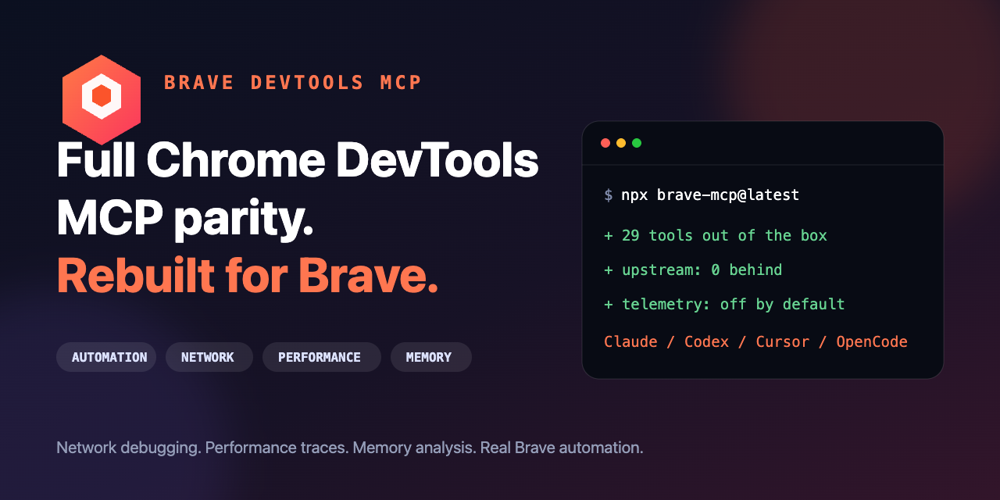

# Brave DevTools for agents

**Full Chrome DevTools MCP parity, rebuilt for Brave.**

[](https://github.com/triuzzi/brave-devtools-mcp/actions/workflows/run-tests.yml)
[](https://www.npmjs.com/package/brave-mcp)
[](https://www.npmjs.com/package/brave-mcp)
[](https://registry.modelcontextprotocol.io/v0.1/servers?search=io.github.triuzzi%2Fbrave-mcp)
[](https://www.npmjs.com/package/brave-mcp#provenance)
[](https://github.com/triuzzi/brave-devtools-mcp/compare/ChromeDevTools:main...main)
[](./LICENSE)



`brave-mcp` gives Claude Code, Codex, Cursor, OpenCode, and other MCP clients direct access to Brave for browser automation, network and console debugging, performance analysis, screenshots, accessibility inspection, and memory profiling. A standalone [`brave-devtools`](docs/cli.md) CLI is included too.

## Install in one command

The commands below use `--autoConnect`, which attaches `brave-mcp` to the Brave you already have open, so the agent works with your real tabs and signed-in sessions. Prefer launching Brave with CLI-owned remote debugging (`--remote-debugging-port=9222` and `--disable-features=DevToolsAcceptDebuggingConnections`) so agents do not trip Brave's per-connection **Allow remote debugging?** dialog. See [Connecting to a running Brave instance](./docs/advanced-usage.md#connecting-to-a-running-brave-instance).

### Claude Code

```bash
claude mcp add brave-devtools --scope user -- npx -y brave-mcp@latest --autoConnect
```

### Cursor

```bash
cursor --add-mcp '{"name":"brave-devtools","command":"npx","args":["-y","brave-mcp@latest","--autoConnect"]}'
```

### Codex

```bash
codex mcp add brave-devtools -- npx -y brave-mcp@latest --autoConnect
```

### OpenCode

```bash
opencode mcp add brave-devtools -- npx -y brave-mcp@latest --autoConnect
```

Restart your client, then try this prompt:

> Open my app in Brave. Find console errors and failed network requests, inspect the accessibility tree, run Lighthouse, and explain the highest-impact issue.

With CLI-owned debugging, the agent connects without a native permission prompt. If `/json/version` returns 404 while the debug port is open, Brave is consent-gated — quit and relaunch with the flags above rather than clicking **Allow**.

`--autoConnect` attaches to Brave Release unless you add `--channel beta` or `--channel nightly`. To keep the agent out of your everyday browser, leave out `--autoConnect`: the server then launches its own Brave with a dedicated profile.

## Why use this instead of Chrome DevTools MCP?

| Capability                               | `brave-mcp`                             | `chrome-devtools-mcp`                |
| ---------------------------------------- | --------------------------------------- | ------------------------------------ |
| Browser launched and discovered natively | Brave Release, Beta, and Nightly        | Chrome Stable, Beta, Dev, and Canary |
| Attach to an existing browser            | Brave profiles, HTTP, or WebSocket      | Chrome profiles, HTTP, or WebSocket  |
| Upstream DevTools features               | Full parity; currently 0 commits behind | Source implementation                |
| Usage telemetry                          | Disabled by default                     | Enabled by default                   |
| Standalone CLI                           | `brave-devtools`                        | `chrome-devtools`                    |

Use [Chrome DevTools MCP](https://github.com/ChromeDevTools/chrome-devtools-mcp) when your target browser is Chrome. Use `brave-mcp` when your target browser is Brave and you want Brave-native discovery, profiles, channels, naming, and privacy defaults without giving up upstream features.

## [Tool reference](./docs/tool-reference.md) | [Changelog](./CHANGELOG.md) | [Contributing](./CONTRIBUTING.md) | [Troubleshooting](./docs/troubleshooting.md) | [Design principles](./docs/design-principles.md)

## Key features

- **Get performance insights**: Uses [Chrome
  DevTools](https://github.com/ChromeDevTools/devtools-frontend) to record
  traces and extract actionable performance insights.
- **Advanced browser debugging**: Analyze network requests, take screenshots and
  check browser console messages (with source-mapped stack traces).
- **Reliable automation**. Uses
  [puppeteer](https://github.com/puppeteer/puppeteer) to automate actions in
  Brave and automatically wait for action results.

## Disclaimers

`brave-mcp` exposes content of the browser instance to the MCP clients
allowing them to inspect, debug, and modify any data in the browser or DevTools.
Avoid sharing sensitive or personal information that you don't want to share with
MCP clients.

`brave-mcp` officially supports the current Brave release. Beta and Nightly channels can be selected explicitly.

Performance tools may send trace URLs to the Google CrUX API to fetch real-user
experience data. This helps provide a holistic performance picture by
presenting field data alongside lab data. This data is collected by the [Chrome
User Experience Report (CrUX)](https://developer.chrome.com/docs/crux). To disable
this, run with the `--no-performance-crux` flag.

## **Usage statistics**

Usage statistics collection is **disabled by default** in this fork. It can be enabled explicitly with `--usage-statistics`, which uses the upstream Google Clearcut implementation:

```json
"args": ["-y", "brave-mcp@latest", "--usage-statistics"]
```

When enabled, Google handles this data in accordance with the [Google Privacy Policy](https://policies.google.com/privacy). Collection remains disabled if `BRAVE_DEVTOOLS_MCP_NO_USAGE_STATISTICS` or `CI` is set.

## Update checks

By default, the server periodically checks the npm registry for updates and logs a notification when a newer version is available.
You can disable these update checks by setting `BRAVE_DEVTOOLS_MCP_NO_UPDATE_CHECKS`.

## Requirements

- [Node.js](https://nodejs.org/) [LTS](https://github.com/nodejs/Release#release-schedule) version.
- [Brave](https://brave.com/download/) current release or newer.
- [npm](https://www.npmjs.com/)

## Getting started

Start Brave with CLI-owned remote debugging (see [advanced usage](./docs/advanced-usage.md#connecting-to-a-running-brave-instance)), then add the following config to your MCP client to attach to your running Brave:

```json
{
  "mcpServers": {
    "brave-devtools": {
      "command": "npx",
      "args": ["-y", "brave-mcp@latest", "--autoConnect"]
    }
  }
}
```

> [!NOTE]
> Using `brave-mcp@latest` ensures that your MCP client will always use the latest version of the Brave DevTools MCP server.

Leave out `--autoConnect` to have the server launch its own Brave with a dedicated profile instead.

If you are interested in doing only basic browser tasks, use the `--slim` mode:

```json
{
  "mcpServers": {
    "brave-devtools": {
      "command": "npx",
      "args": ["-y", "brave-mcp@latest", "--slim", "--headless"]
    }
  }
}
```

See [Slim tool reference](./docs/slim-tool-reference.md).

### MCP Client configuration

For setup instructions specific to your editor or agent (e.g. Antigravity, Claude Code, Cursor, VS Code), please see our [Client Configurations Guide][client-configurations-guide]. To attach to your running Brave, add `--autoConnect` to the server arguments shown there.

### Your first prompt

Enter the following prompt in your MCP Client to check if everything is working:

```
Check the performance of https://brave.com
```

Your MCP client opens the page in Brave and records a performance trace. If Brave raises an **Allow remote debugging?** dialog, the session is consent-gated — see [Troubleshooting](./docs/troubleshooting.md#consent-gated-remote-debugging-jsonversion-returns-404).

> [!NOTE]
> The MCP server connects to Brave only when the MCP client first uses a tool that needs a browser, not when the client starts. Without `--autoConnect`, that is when the server launches its own Brave.

## Tools

If you run into any issues, checkout our [troubleshooting guide][troubleshooting].
See the full [Tool reference][tool-reference] for a complete list of all supported MCP capabilities.

## Configuration

Find the complete list of server parameters (e.g., `--headless`, `--isolated`, `--slim`) and how to configure WebSocket connections in the [Configuration Guide][configuration-guide].

## Advanced usage

For advanced features such as handling concurrent sessions, persistent user data directories, connecting to a running Brave instance instead of starting a new one, or debugging on Android, see our [Advanced Usage Guide][advanced-usage-guide].

## Known limitations

See [Troubleshooting][troubleshooting].

## Integrating as a browser subagent

If you are developing agentic tooling and want to provide an integrated browser subagent as part of your product, we recommend building on top of Brave DevTools for agents.

For a reference implementation, see the [Gemini CLI browser agent documentation](https://geminicli.com/docs/core/subagents/#browser-agent).

[advanced-usage-guide]: ./docs/advanced-usage.md
[client-configurations-guide]: ./docs/client-configurations.md
[configuration-guide]: ./docs/configuration.md
[tool-reference]: ./docs/tool-reference.md
[troubleshooting]: ./docs/troubleshooting.md
